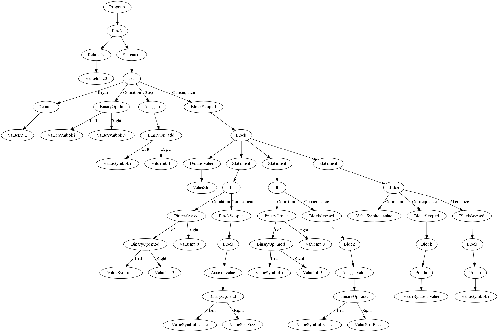

## Requirements

- `pip install rply graphviz`
- [Graphviz](https://graphviz.gitlab.io/download/) executable in PATH

## Running REPL

```bash
$ python main.py
> 12 + 3.5 * 5.
29.5
```

## Running script

```bash
$ python main.py examples/functions.kut
13^2 = 169
6^9 = 10077696
PI = 3.1415926
Hello World!
1337
1
2
3
5
8
13
21
34
55
89
144
233
377
610
987
```

## Drawing the AST

```bash
$ python main.py examples/fizzbuzz.kut --ast
1
2
Fizz
4
Buzz
Fizz
7
8
Fizz
Buzz
11
Fizz
13
14
FizzBuzz
16
17
Fizz
19
Buzz
```


